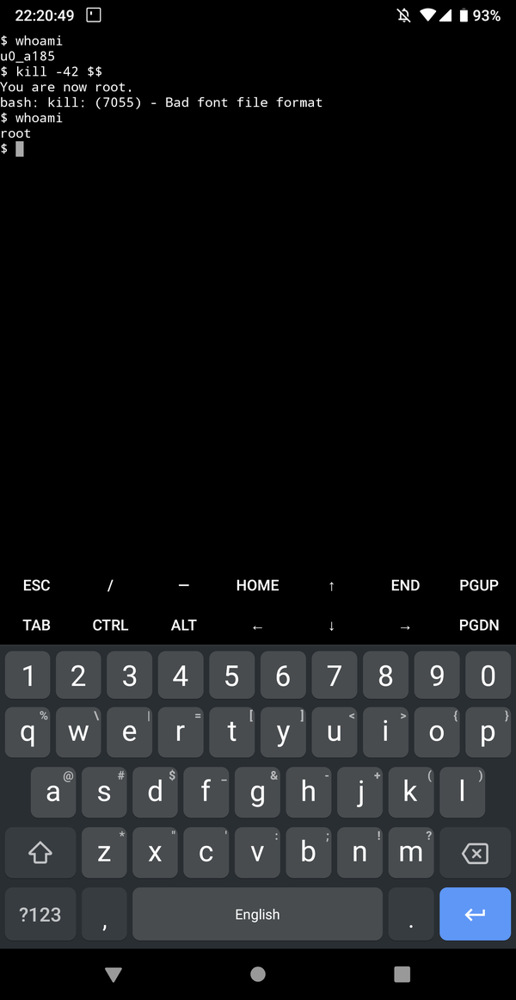

## Android Kernel Development Backdoor

Like being able to do quick cycles of `fastboot boot
out/arch/arm64/boot/Image.lz4-dtb`, but annoyed by the lack of root this way?
Well this atrocious idea might be the thing for you!

#### Possibly the worst idea ever.

This is an awful idea! If you're silly, you'll add this to your kernel, and
then forget to turn it off for production builds, and then very bad things will
happen. This here probably is not for you! If you're reading this sentence,
start backing away slowly! Out, damned spot!

#### Add it to your kernel!

From inside a clean kernel tree of yours:

```
$ curl -LsS "https://git.zx2c4.com/android-kernel-development-backdoor/plain/fetch-and-patch.sh" | bash -
```

Then, make sure `CONFIG_ANDROID_ROOTME=y` is enabled.


But don't do it! I take no responsibility for the dumpster fire this will
cause. You'll probably forget to remove this for your release kernels. There
are probably better ways to manage this kind of thing anyway. Don't do it! Just
say "no" to backdoors! N.O.

#### Pop a root shell?

Send signal 42 to yourself to escalate.

```
thinkpad $ adb shell
crosshatch:/ $ whoami
shell
crosshatch:/ $ kill -42 $$
You are now root.
/system/bin/sh: kill: 1243: Bad font file format
1|crosshatch:/ $ whoami
root
```


